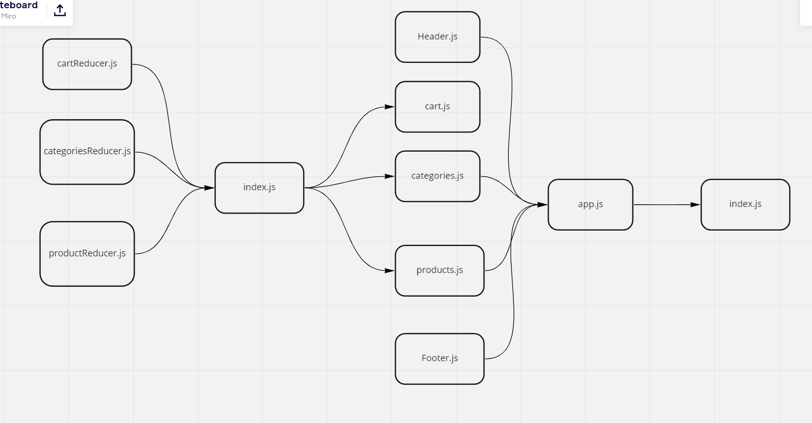

# [Netlify Link](https://629cffff61a99d7ee91d86e4--gilded-paprenjak-be53ab.netlify.app/)
## Phase-1
## UML 

- As a user, I expect to see a list of available product categories in the store so that I can easily browse products
- As a user, I want to choose a category and see a list of all available products matching that category
- As a user, I want a clean, easy to use user interface so that I can shop the online store with confidence  
### [PR phase-1](https://github.com/idreesalmasri/storefront/pull/3)

### phase-2 
### 
### [PR phase-2](
- As a user, I want to choose from products in the list and add them to my shopping cart
- As a user, I want to see the products that I’ve added to my shopping cart so that
- As a user, I want to change the quantity of items I intend to purchase in my shopping cart
- As a user, I want to be able to remove an item from my shopping cart
